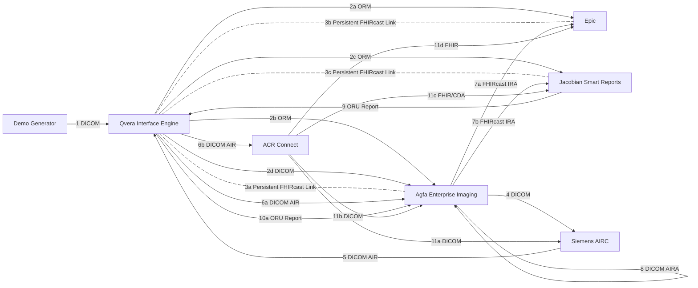

# Team Becquerel Flow Chart

```mermaid
flowchart LR
    Generator[Demo Generator] --> |1 DICOM| Qvera[Qvera Interface Engine]
 
    Qvera --> |2a ORM| Epic
    Qvera --> |2b ORM| Agfa[Agfa Enterprise Imaging]
    Qvera --> |2c ORM| Jacobian[Jacobian Smart Reports]
    Qvera --> |2d DICOM| Agfa

    Qvera e1@-- 3a Persistent FHIRcast Link --- Agfa
    e1@{ animation: fast } 
    Qvera e2@-- 3b Persistent FHIRcast Link --- Epic
    e2@{ animation: fast } 
    Qvera e3@-- 3c Persistent FHIRcast Link --- Jacobian
    e3@{ animation: fast } 

    Agfa --> |4 DICOM| Siemens[Siemens AIRC]

    Siemens --> |5 DICOM AIR| Qvera

    Qvera --> |6a DICOM AIR| Agfa
    Qvera --> |6b DICOM AIR| ACR[ACR Connect]

    Agfa --> |7a FHIRcast IRA| Epic
    Agfa --> |7b FHIRcast IRA| Jacobian
    %% Assuming AI results will flow to Jacbian via FHIRcast

    Agfa --> |8 DICOM AIRA| Agfa
    %% Accept/reject findings... Anywhere else to send these?!?

    Jacobian --> |9 ORU Report| Qvera
    %% OR should we use FHIR?!?

    Qvera --> |10a ORU Report| Agfa

    ACR --> |11a DICOM| Siemens
    ACR --> |11b DICOM| Agfa
    ACR --> |11c FHIR/CDA| Jacobian
    ACR --> |11d FHIR| Epic
```
