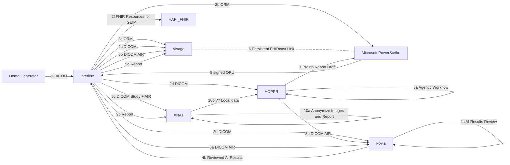

# Team Edison Flow Chart

```mermaid
flowchart LR
    Generator[Demo Generator] --> |1 DICOM| Interlinx
    
    %% TODO Where will the PowerScribe bridge be installed?!?
    Interlinx --> |2a ORM| Visage
    Interlinx --> |2b ORM| Microsoft[Microsoft PowerScribe]
    Interlinx --> |2c DICOM| Visage
    Interlinx --> |2d DICOM| HOPPR
    Interlinx --> |2e DICOM| Fovia
    Interlinx --> |2f FHIR Resources for GEIP| HAPI_FHIR

    HOPPR --> |3a Agentic Workflow| HOPPR
    HOPPR --> |3b DICOM AIR| Fovia

    %% Fovia has two outputs: DICOM SR, CDE encoded output report
    Fovia --> |4a AI Results Review| Fovia
    Fovia --> |4b Reviewed AI Results| Interlinx
    %% Send information to Microsoft in FHIR?!? 

    Interlinx --> |5a DICOM AIR| Fovia
    Interlinx --> |5b DICOM AIR| Visage
    Interlinx --> |5c DICOM Study + AIR| XNAT
    %% Can Interlinx hold the whole study until this step?!?

    Visage e1@-- 6 Persistent FHIRcast Link --- Microsoft
    e1@{ animation: fast } 

    HOPPR --> |7 Presto Report Draft| Microsoft
    %% Exact syntax not known

    Microsoft --> |8 signed ORU| Interlinx

    Interlinx --> |9a Report| Visage
    Interlinx --> |9b Report| XNAT
    %% This will be a RESTful call

    XNAT --> |10a Anonymize Images and Report| XNAT
    XNAT --> |10b ?? Local data| HOPPR
```
