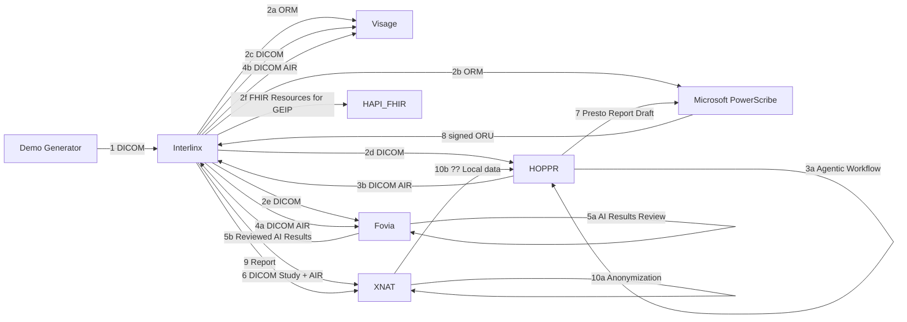

# Team Edison Flow Chart

```mermaid
flowchart LR
    Generator[Demo Generator] --> |1 DICOM| Interlinx
    
    %% TODO Where will the PowerScribe bridge be installed?!?
    Interlinx --> |2a ORM| Visage
    Interlinx --> |2b ORM| Microsoft[Microsoft PowerScribe]
    Interlinx --> |2c DICOM| Visage
    Interlinx --> |2d DICOM| HOPPR
    Interlinx --> |2e DICOM| Fovia
    Interlinx --> |2f FHIR Resources for GEIP| HAPI_FHIR

    HOPPR --> |3a Agentic Workflow| HOPPR
    HOPPR --> |3b DICOM AIR| Interlinx

    Interlinx --> |4a DICOM AIR| Fovia
    Interlinx --> |4b DICOM AIR| Visage

    Fovia --> |5a AI Results Review| Fovia
    Fovia --> |5b Reviewed AI Results| Interlinx

    Interlinx --> |6 DICOM Study + AIR| XNAT
    %% Can Interlinx hold the whole study until this step?!?

    HOPPR --> |7 Presto Report Draft| Microsoft

    Microsoft --> |8 signed ORU| Interlinx

    Interlinx --> |9 Report| XNAT
    %% This will be a RESTful call

    XNAT --> |10a Anonymization| XNAT
    XNAT --> |10b ?? Local data| HOPPR
```